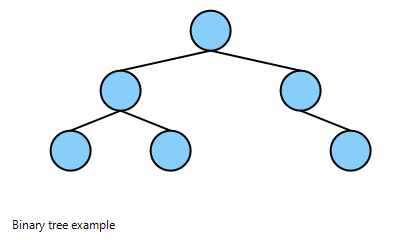

# CliTest

This repository is a playground for CLI experiments.

## Binary Trees (brief overview)

A binary tree is a hierarchical data structure where each node has at most two children, commonly named "left" and "right". It's used for searching (BST), heaps, expression parsing, and more.

Properties:
- Each node has 0, 1, or 2 children
- Height: longest path from root to leaf
- Balanced trees (e.g., AVL, Red-Black) maintain O(log n) operations

Simple ASCII diagram:

       1
      / \
     2   3
    / \   \
   4   5   6

Example in-order traversal: 4, 2, 5, 1, 3, 6

## Code examples

### C++ (simple BST insert + inorder traversal)

```cpp
#include <iostream>
struct Node {
    int val;
    Node* left;
    Node* right;
    Node(int v): val(v), left(nullptr), right(nullptr) {}
};

Node* insert(Node* root, int v){
    if(!root) return new Node(v);
    if(v < root->val) root->left = insert(root->left, v);
    else root->right = insert(root->right, v);
    return root;
}

void inorder(Node* root){
    if(!root) return;
    inorder(root->left);
    std::cout << root->val << " ";
    inorder(root->right);
}

int main(){
    Node* root = nullptr;
    int vals[] = {1,2,3,4,5,6};
    for(int v: vals) root = insert(root, v);
    inorder(root); // prints 1 2 3 4 5 6 (depending on insert order)
}
```

### Python (same idea)

```python
class Node:
    def __init__(self, val):
        self.val = val
        self.left = None
        self.right = None

def insert(root, v):
    if root is None:
        return Node(v)
    if v < root.val:
        root.left = insert(root.left, v)
    else:
        root.right = insert(root.right, v)
    return root

def inorder(root):
    if not root: return []
    return inorder(root.left) + [root.val] + inorder(root.right)

if __name__ == '__main__':
    root = None
    for v in [1,2,3,4,5,6]:
        root = insert(root, v)
    print(inorder(root))
```

### Visual Reference



## Binary Tree UI (Win32 GUI)

A native Windows desktop application has been added under src\binary_tree_ui/ that provides a small GUI for building and visualizing a Binary Search Tree (BST).

Features

- Enter a comma-separated list of integers and build a BST using insertion order.
- Visualize the tree using GDI+ (nodes drawn as circles, edges as lines).
- "Build Tree" computes node positions and redraws the visualization.
- "Export PNG" saves the current visualization as binary_tree_export.png in the working directory where the EXE is run (typically build\Release).

Where to find the code

- src\binary_tree_ui/CMakeLists.txt — CMake project and build config
- src\binary_tree_ui/include/Tree.h — Tree node and BinaryTree class
- src\binary_tree_ui/src/Tree.cpp — insertion, cleanup, and position assignment
- src\binary_tree_ui/src/main.cpp — Win32 application and GDI+ rendering logic

For more details on the UI implementation, see [Binary Tree UI README](src/binary_tree_ui/README.md).

Prerequisites

- Windows with Visual Studio (Desktop C++ workload) or MSVC Build Tools installed
- CMake (>= 3.8). Install via winget: `winget install --id Kitware.CMake`

Build (PowerShell)

Set-Location 'C:\Users\bartz\source\repos\CliTest\src\binary_tree_ui'
mkdir build
Set-Location build
cmake .. -G "Visual Studio 17 2022" -A x64
cmake --build . --config Release

Run

- Run the produced BinaryTreeUI.exe (e.g., build\Release\BinaryTreeUI.exe).
- Enter comma-separated integers (e.g., `1,2,3,4,5,6`) in the input box.
- Click "Build Tree" to construct and display the BST.
- Click "Export PNG" to save the visualization (binary_tree_export.png).

Behavior details

- Duplicate values are allowed and will be inserted to the right (code uses `if (v < node->val) left else right`).
- Node layout uses in-order traversal to assign X positions and depth for Y positions, which works well for small-to-medium trees.
- Export is implemented by rendering the scene to an off-screen GDI+ bitmap and saving it as PNG.

Troubleshooting

- If CMake is not available, open the src\binary_tree_ui folder in Visual Studio and build the generated project.
- If the EXE does not render correctly, ensure GDI+ is available (standard on modern Windows) and try running the Release build directly.

Contributing

Improvements and fixes welcome. Create a branch and open a pull request. The feature branch for development is `feature/binary-tree-ui`.

**Binary Tree UI added by Copilot CLI on May 23, 2026 15:46:40**
